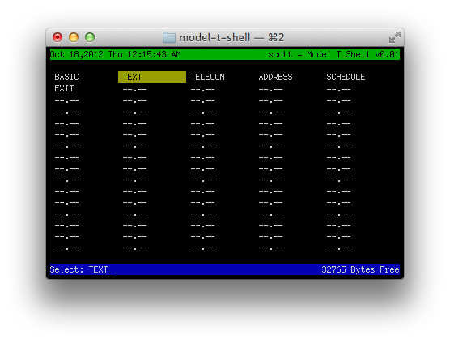

model-t-shell
=============

This is a shell that simulates the interface on the Tandy 100/102/200
"Model T" portable computer.

I have no real goals for this, other than to see if I could make it, 
and what kinds of things could be done to modernize the M100 experience.

# Host Platforms

This should build on OS X, and eventually for linux and MinGW.

# Implemented functionality

When you run model-t-shell, it should bring up an M100-like interface, showing
the date and time in the top left, your username in the top right and an 
input line at the bottom.

Arrow keys will move around the program and file list.

Currently, there are just some dummy entries, although "EXIT" does
in fact work.

# Future

Perhaps break out the everything-list into commands/commandables
and data files. At that point, it gets close to "Directory Opus"
in style.  Separating these two out may make sense for modern 
computing.  TAB could be used to switch between them
